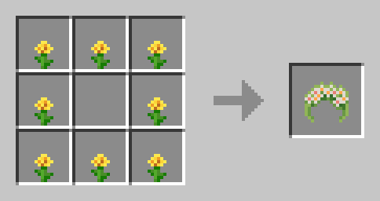

# Sanity: Descent Into Madness (Renewed)

A Minecraft mod that brings the sanity mechanic from [Don't Starve](https://store.steampowered.com/app/219740/Dont_Starve/) into Minecraft.

> **注意 / Note:** 本项目是 [croissantnova](https://modrinth.com/user/croissantnova) 原作的 **NeoForge 移植版**。由于原模组在 Forge 平台已停更，本人将其移植至 NeoForge 平台并继续维护。若你游玩的是 Forge 版 Minecraft，请移步至原项目：[Modrinth](https://modrinth.com/mod/sanity-descent-into-madness)
>
> This is a **NeoForge port** of the original mod by [croissantnova](https://modrinth.com/user/croissantnova). Since the original mod is no longer updated on Forge, this project ports it to NeoForge and continues its maintenance. If you play on Forge, please visit the original project at [Modrinth](https://modrinth.com/mod/sanity-descent-into-madness).

## Requirements

<a aria-label="Minecraft NeoForge" href="https://maven.neoforged.net/releases/net/neoforged/neoforge/21.1.241/neoforge-21.1.241-installer.jar">

</a>
<a aria-label="GeckoLib" href="https://modrinth.com/mod/geckolib">

</a>

## Description

This mod adds a new vital for you to manage - sanity, your mental health scale.
Failing to keep your sanity at high levels may have drastic consequences on your survival,
including fatal outcome.
<br/><br/>
As your sanity drops, you start hearing and seeing things, your vision becomes muddy and blurry,
as well as your mind cloudy, until eventually you start getting attacked by the creations of your own mind, inner entities.


There are multiple ways to restore your sanity, as well as multiple ways to lose it.
<br/>
The first thing you might want to do, however, is to craft a garland from any small flowers you encounter on your journey.
This nice little accessory should help you stay sane for a bit longer. Be wary, though, that water makes it wither away much faster!



## Details

For details on all implemented sanity sources, see [configuration file](config.toml).<br/>
The mod also supports dimension-specific configuration in ```config/sanitydim/dimension/dimension_id.toml```.<br/>
You're free to include this mod in your modpacks.

## Credits

**Original Author:** [croissantnova](https://modrinth.com/user/croissantnova) — programmer and artist of the original mod

**NeoForge Port & Maintenance:** [whaleghost](https://github.com/whaleghost)

**Art:** [toujourspareil](https://twitter.com/toujourspareil_)

Sound effects provided by [Zapsplat](https://www.zapsplat.com/)

## License
See [license](https://raw.githubusercontent.com/whaleghost/SanityDescentIntoMadnessRenewed/main/LICENSE).